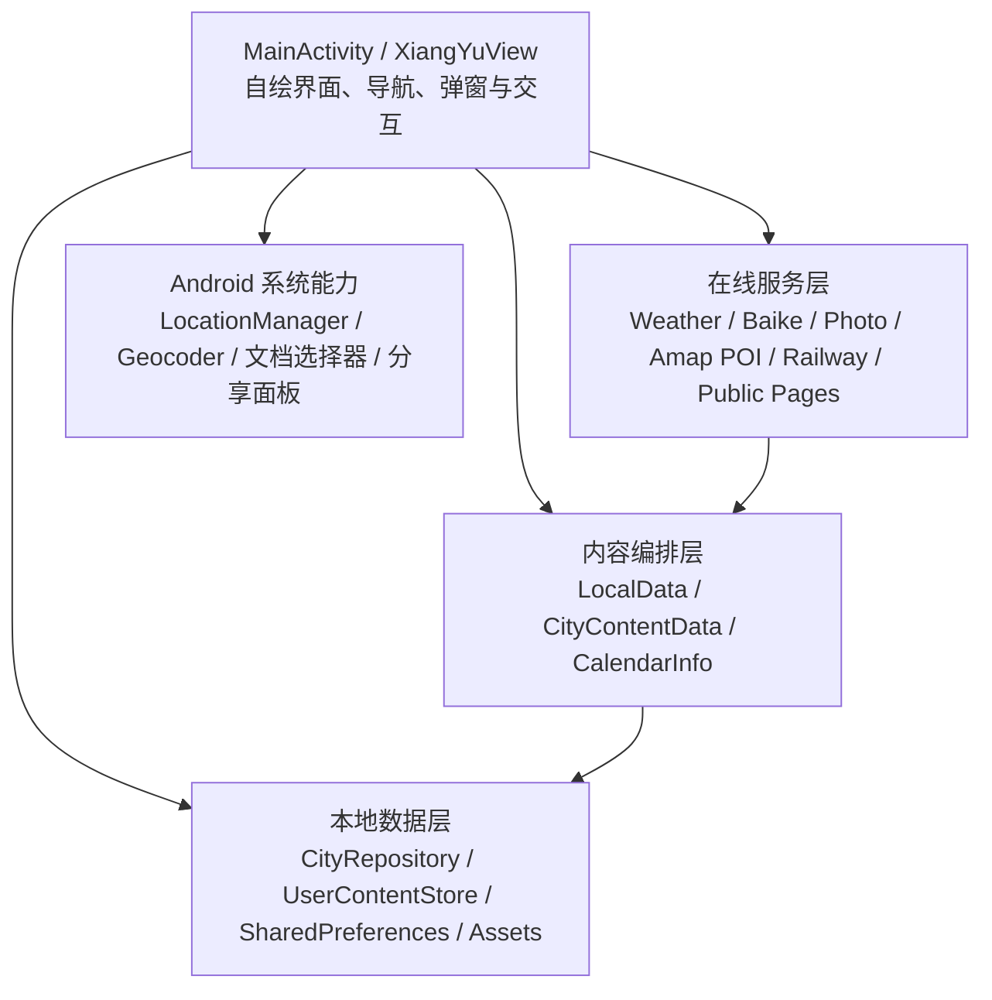

# 乡遇 Android 软件开发历程与架构说明

## 一、项目概述

“乡遇”最初被设想为一款将万年历、天气和本地旅行生活信息整合到一起的 Android 应用。随着实际试用和持续反馈，项目逐步从一个可安装的单页原型，演变为覆盖全国 337 个地级行政区，包含小吃、民俗、景区、平价酒店、交通、避坑、笔记和分享能力的旅行生活工具。

当前技术版本为 `1.9.3`，应用包名为 `cn.xiangyu.travelguide`，最低支持 Android 8.0（API 26），以 Android 15 SDK（API 35）编译并面向 API 35。正式 APK 约 263 KB，仍保持非常轻量，主要原因是项目采用原生 Java、自绘界面和系统 API，没有引入广告、统计、支付或大型第三方 UI SDK。

从开发目标看，项目经历了四次明显转型：

1. 从“能安装、能启动”转向 Android 16 和模拟器稳定运行。
2. 从“日历天气首页”转向吃、住、行、游、避坑和个人笔记的完整产品。
3. 从省级或模板化推荐转向全国地市级独立数据和动态 POI。
4. 从功能可用转向正式签名、最小权限、安全误报整改和应用市场隐私合规。

## 二、开发阶段总览

| 阶段 | 版本范围 | 核心任务 | 结果 |
| --- | --- | --- | --- |
| 原型与兼容 | 1.1.0-1.3.0 | 完成安装包、Android 16 启动、雷电模拟器稳定性和基础内容结构 | 从原型变成可实际运行的应用 |
| 功能与体验扩展 | 1.4.0-1.6.1 | 黄历、图片、酒店、详情、响应式布局、笔记共享和全国地市差异化 | 形成完整的旅行生活产品框架 |
| 全国化与平台化 | 1.7.0-1.8.9 | GitHub 工程化、交通、避坑、全国数据、正式签名、安全配置和统一数据源 | 形成可维护、可构建、可发布的工程 |
| 数据质量与合规 | 1.9.0-1.9.3 | 店铺和酒店细化、图片去重、安全误报、高德 POI、隐私政策和市场上架准备 | 达到公开分发前的技术与合规状态 |

## 三、逐版本演变

### 1.1.x：可安装原型与系统兼容

#### 1.1.0

- 生成首个可直接安装的 APK。
- 建立万年历、天气、位置和当地内容的基本产品方向。
- 完成原生 Android 工程、启动 Activity 和首页基本绘制。
- 该版本的重点是验证“能构建、能安装、能进入应用”。

#### 1.1.1

- 针对 Android 16 安装后出现半透明界面、启动窗口异常的问题调整主题和启动流程。
- 避免在首帧前执行可能导致窗口变暗或无内容的操作。
- 形成后续所有版本的 Android 16 兼容基础。

#### 1.1.2

- 处理雷电模拟器定制系统中频繁闪退的问题。
- 避免直接依赖部分模拟器实现不完整的系统栏和窗口接口。
- 增强异常降级，使定位或系统能力不可用时仍能进入主界面。

### 1.2.x：个人内容与产品分区

#### 1.2.0

- 增加笔记、收藏和系统分享能力。
- 支持用户自主新增、修改小吃、风俗、景区、避坑和酒店资料。
- 新增酒店推荐模块，应用开始从“信息展示”转向“可参与维护的个人旅行工具”。

#### 1.2.1

- 明确“今日”和“发现”的职责差异。
- 今日页聚焦天气、日期、黄历；发现页负责城市小吃、民俗、景区、住宿等内容。
- 建立底部三页导航的产品结构：今日、发现、收藏。

### 1.3.0：景区详情和周边联动

- 扩充景点数量和景点介绍。
- 点击景点后展示附近美食、住宿和交通汇聚点。
- 景区不再是孤立条目，而成为周边吃住行信息的入口。
- 这一版本首次形成“目的地详情 -> 周边服务”的旅行场景链路。

### 1.4.x：首页内容和响应式体验

#### 1.4.0

- 今日页扩充黄历信息，包括农历、干支生肖、节气、节日、宜忌、周次和全年天数。
- 首页下部加入当地著名景点图片轮播。
- 确立“天气 + 万年历 + 城市影像”的首页信息层级。

#### 1.4.2

- 扩大首页图片展示面积。
- 减少图片下方无效留白，提高首屏信息利用率。
- 调整图片裁切和内容间距，使轮播更接近旅行应用的视觉重点。

#### 1.4.3

- 酒店模块改为平价优先。
- 三星及以上、高档类型和已知高端品牌不进入前列，优先展示宾馆、快捷酒店、青旅、客栈和民宿。

#### 1.4.4

- 小吃、民俗、景区和酒店详情增加实景图片。
- 条目从纯文字列表升级为图文详情。

#### 1.4.5

- 固定顶部“乡遇”、副标题和位置区域，不再随内容滚动。
- 按真机截图调整顶部距离，使品牌与状态栏之间更协调。

#### 1.4.6

- 加入分辨率和长宽比自适应。
- 根据可用宽高、横竖屏和分屏状态动态计算绘制密度。
- 解决不同手机和模拟器上控件挤压、留白过多或内容越界的问题。

#### 1.4.7

- 继续微调标题和位置区域的纵向位置。
- 压缩黄历卡片和天气区域，为首页图片保留完整空间。
- 目标从“可滚动查看”转向“首页首屏尽量完整展示”。

#### 1.4.8

- 增加小吃、风俗和酒店推荐数量。
- 条目详情补充说明和外部公开资料入口。
- 加强城市内容的可读性，不再只显示短标签。

#### 1.4.9

- 数据来源选择开始强调中国大陆网络可访问性。
- 将来源逐步收敛到百度百科、必应和国内生活内容平台，减少不稳定入口。

### 1.5.x：固定导航与记事本共享

#### 1.5.0

- 发现页分类菜单固定，小吃、风俗等菜单不随列表滚动。
- 提升频繁切换分类时的操作效率。

#### 1.5.1

- 增加个人记事本导入和导出。
- 使用 Android 系统文档选择器读写 JSON，不申请文件或存储权限。
- 导入采取合并策略，不清空本机其他数据；相同条目可更新笔记。

#### 1.5.2

- 开始系统处理不同地市内容重复的问题。
- 郑州、洛阳等同省城市不再直接共用同一份小吃和民俗模板。
- 城市代码成为内容归属、缓存和用户数据关联的关键标识。

### 1.6.x：全国地市覆盖

#### 1.6.0

- 按全国地级行政区重构城市目录和内容生成规则。
- 建立地市代码、名称、省份、坐标及内容状态清单。
- 定位不再只匹配省份，而是匹配最近或解析得到的地级市。

#### 1.6.1

- 对全国覆盖结果进行补漏和差异检查。
- 修复部分城市仍继承省级模板、内容归属不正确和条目数量不足的问题。
- 引入启动期覆盖校验思想，为后续 337 城完整性检查奠定基础。

> 说明：`1.1.0-1.6.1` 早于 Git 仓库建立，上述记录依据保留的 APK、文件时间及需求实施顺序还原；`1.7.0` 起可由 Git 提交逐项核对。

### 1.7.0：工程化基线与 GitHub 首版

- 形成首个完整 GitHub 工程版本，是后续版本可追溯的基线。
- 项目具备 Gradle Wrapper、GitHub Actions、README、贡献说明和第三方来源说明。
- 内置全国城市目录、天气、黄历、地方内容、图片、避坑、周边服务、笔记和收藏等模块。
- 首页图片开始严格绑定当前地市，城市切换后重新请求，避免上一城市图片回填。
- 小吃详情加入具体店铺推荐方向，景区和生活避坑信息进一步细化。
- APK 约 157 KB，说明在功能快速增长的同时仍保持轻量。

### 1.8.x：交通、安全和全国内容架构重组

#### 1.8.0

- 发现页增加交通分类。
- 以城市主要高铁站或铁路枢纽为出发点，提供前往景点的公共交通入口。
- 省会城市增加前往省内其他地市的铁路查询，读取 12306 公开车次、发到时间和历时。

#### 1.8.1

- 分类顺序固定为小吃、风俗、景区、酒店、交通、避坑。
- 避坑扩展到出租车与包车、购物团、重复售票、现场管理、消费和远郊返程等主题。
- 避坑内容从泛化提醒转向可核查的旅行风险清单。

#### 1.8.2

- 根据真机截图上移整体内容，缩小顶部无效距离。
- 持续调整品牌、位置和首屏布局。

#### 1.8.3

- 进一步压缩首页天气和黄历区域。
- 确保景点图片在常见 1080 x 1920 视口中无需上滑即可完整看到。
- 针对雷电模拟器和不同状态栏高度进行实机验证。

#### 1.8.4

- 正式版权限收紧为 `INTERNET` 和 `ACCESS_COARSE_LOCATION`。
- GitHub Actions 改为构建 Release 包并执行安全检查。
- 禁止明文网络，强化正式构建配置。

#### 1.8.5

- 应用安装标识改为 `cn.xiangyu.travelguide`，摆脱早期包名可能积累的安全误报记录。
- 启用乡遇专用 RSA 4096 位正式证书，后续版本保持同一签名以支持覆盖升级。
- 增加荣耀手机安全安装说明，明确侧载未审核提示和真实权限的区别。

#### 1.8.6

- 重点优化本地榜单、图片去重和小众景区。
- 新增酒店候选排序服务，过滤明显高档住宿。
- 景区扩展到亲子遛娃、红色学习、自然保护地、山峰瀑布、动物园和主题公园。
- 图片使用内容指纹识别近似重复，减少轮播中同图反复出现。

#### 1.8.7

- 对全国内容来源和服务层进行一次大规模重构。
- 移除体积较大的全国 5A 景区静态 JSON 和旧景区仓库，改为统一城市内容、百科和公开检索组合。
- 重写小吃、酒店、景区、图片和周边服务的数据获取流程，明显缩小安装包。

#### 1.8.8

- 作为全国城市具体数据生成的过渡构建，版本号为 32。
- 将地市差异化内容固化进应用，减少运行时模板复用。
- 为下一版本的 `CityContentData` 全量落地和旧动态服务删除做准备。

#### 1.8.9

- 新增 `CityContentData.java`，集中保存全国 337 个地级市的具体小吃、民俗和景区条目。
- 删除旧的 `CityContentService`、`DestinationService` 和 `KnowledgeService`，降低多套内容逻辑并存造成的不一致。
- 第二页详情直接展示结果，优化弹窗排版和信息密度。
- 生活内容来源收敛为百科、美团和小红书等公开资料，并加强来源标识。

### 1.9.x：数据可信度、安全与上架合规

#### 1.9.0

- 避坑细分为六类可执行检查项，并增加公开平台近期线索。
- 小吃和住宿推荐进一步细化为具体店名候选。
- 首页图片增加到 5-8 张，严格使用具体景点名检索。
- 去除容易与城市不匹配的通用“滨水公园、老城区”补位图，强化图片近似去重。
- 景区详情增加历史背景、核心看点、适合人群和行前提醒。

#### 1.9.1

- 集中整改荣耀等系统的安全误报问题。
- 图片来源切换为必应缩略图，排除百度图片来源，并只允许 HTTPS 和必应可信图片主机。
- 新增 `ContentSafety` 过滤公开页面中的异常标题。
- 禁止云备份和设备迁移，个人笔记保持在应用私有数据区。
- GitHub Actions 加入 APK 权限白名单；一旦出现第三项权限，构建直接失败。
- 增加 Android 12 以上主题配置，继续提高 Android 16 启动稳定性。

#### 1.9.2

- 正式接入高德开放平台 Web 服务 POI。
- 小吃详情可显示最多 5 家具体店铺，包含名称、地址、距离及平台可用的评分和人均字段。
- 酒店优先检索青旅、民宿、客栈、宾馆和快捷酒店，过滤三星及以上和已知高端品牌。
- 景点详情可查询约 5 公里内的餐饮、平价住宿及铁路、地铁、公交、停车等交通 POI。
- 高德 Key 从未纳入 Git 的 `local.properties` 注入，公开仓库不保存密钥。
- 正式包继续只保留联网和粗略位置权限。

#### 1.9.3

- 为荣耀应用市场等公开渠道补充隐私合规流程。
- 首次启动在任何在线内容请求前展示隐私保护说明，用户同意后才加载天气、图片和公开旅行资料。
- 粗略位置权限增加单独用途说明，只有用户主动选择定位后才调起系统授权。
- 用户拒绝位置权限后仍可手动选城，不影响万年历和离线城市内容。
- 收藏页增加长期可访问的隐私政策与权限说明入口。
- 新增公开隐私政策页面、上架文案、512 x 512 图标和三张 1080 x 1920 市场截图。
- 版本号提升到 37，使用与 `1.8.5` 以来相同的正式证书签名。
- 模拟器验证了首次隐私弹窗、同意后的首页加载、进程稳定性和两权限白名单。

## 四、当前软件架构

### 4.1 总体架构

项目采用轻量的“单 Activity + 自绘 View + 多服务类”结构，没有使用 Compose、Fragment、Room、Retrofit 或依赖注入框架。

### 4.2 界面层

- `MainActivity.java`：应用入口，处理隐私同意、定位权限、城市选择、日期选择、记事本导入导出和系统窗口配置。
- `MainActivity.XiangYuView`：使用 `Canvas` 和 `Paint` 绘制今日、发现、收藏三页，维护固定顶部、分类菜单、滚动区域和触摸命中范围。
- 响应式策略：根据实际宽高计算内部 density，在窄屏、长屏、横屏、分屏和模拟器动态分辨率下保持稳定布局。
- 详情交互主要使用原生 `AlertDialog`、`ScrollView`、`TextView`、`ImageView` 和 `Button` 动态组装。

这种方案让 APK 很小、视觉高度可控，也避免了第三方 UI 依赖；代价是 `MainActivity` 已接近 1200 行，自动化 UI 测试、无障碍语义和后续多人维护会更困难。

### 4.3 城市与离线内容层

- `prefecture_cities.txt`：337 个地级行政区的代码、名称、省份、坐标和内容状态。
- `CityRepository.java`：解析城市目录，按名称、省份、代码和经纬度查找城市。
- `CityContentData.java`：全国地市级小吃、民俗、景区具体条目，是当前最大的数据文件。
- `LocalData.java`：把城市条目组织成页面可用的 `Place` 和 `Item`，同时提供酒店、避坑和断网降级内容。
- 启动时执行覆盖校验，检查城市代码唯一性、名称、分类数量和条目归属，防止全国数据更新时悄悄缺城。

### 4.4 日历与天气

- `CalendarInfo.java` 使用 Android ICU `ChineseCalendar` 计算农历、干支、生肖、节气、节日和宜忌信息。
- `WeatherService.java` 调用 Open-Meteo HTTPS API 获取温度、高低温、湿度、风速和天气代码。
- 网络失败时返回参考天气，保证首页不会因接口异常空白或崩溃。

### 4.5 在线内容服务层

- `BaikeService.java`：读取百度百科公开摘要和联想条目，补充城市与景区介绍。
- `PhotoService.java`：通过必应图片搜索获取缩略图，只接受 HTTPS 和必应可信主机；按内容指纹去除近似重复图片。
- `AmapPoiService.java`：封装高德文字检索和周边检索，负责 POI 解析、类型筛选、地址、距离、评分和价格字段。
- `FoodShopService.java`：组合高德餐饮 POI 与美团、抖音、小红书公开核对入口。
- `HotelRankService.java`：检索平价住宿并过滤高档品牌或三星以上候选。
- `NearbyService.java`：按景点坐标获取附近餐饮、住宿和交通设施。
- `TransportService.java`：生成景点公共交通入口，并读取 12306 公开车次信息。
- `TravelTipService.java`：组织出租车、购物、门票、管理、消费和返程等避坑主题及公开线索。
- `ContentSafety.java`：过滤公开页面返回的异常标题，防止不适合的搜索内容进入应用。

这些服务各自使用 `ExecutorService` 在后台执行网络请求，再通过回调和 `View.post()` 回到主线程更新界面。图片使用内存缓存和请求代次标识，避免切换城市后旧请求覆盖当前城市。

### 4.6 用户数据层

- `UserContentStore.java` 负责自建条目、修改内容、个人笔记及 JSON 导入导出。
- 数据保存在应用私有 `SharedPreferences` 中，不设服务器账号和云端数据库。
- 收藏页保留条目快照，但普通笔记不会覆盖新版内置内容。
- 导入导出使用系统文档选择器，因此不需要读取文件、相册或外部存储权限。
- 分享通过用户主动点击后打开 Android 系统分享面板，应用本身不直接发送短信或访问通讯录。

### 4.7 构建、发布与安全

- 构建系统：Gradle Kotlin DSL、Android Gradle Plugin 8.7.3、JDK 17。
- Android 配置：`minSdk 26`、`compileSdk 35`、`targetSdk 35`。
- 正式签名：RSA 4096 位专用证书，APK Signature Scheme v2/v3。
- Manifest 只有联网和粗略位置两项权限。
- `usesCleartextTraffic=false`，禁止 HTTP 明文网络。
- `allowBackup=false`，并通过 `data_extraction_rules.xml` 禁止云备份和设备迁移。
- GitHub Actions 构建 Release APK，并检查最终 APK 权限白名单。
- 高德 Key 通过本地配置注入，不进入 Git；公开自动构建不包含生产 Key。

## 五、主要数据流

### 启动流程

1. 创建城市仓库并校验全国覆盖。
2. 先准备上海离线页面，不立即发起在线请求。
3. 首次启动展示隐私说明；同意后加载天气、图片和公开内容。
4. 已授权位置的设备可自动匹配城市；未授权设备显示手动选城入口。
5. 用户主动定位时先展示用途说明，再调用 Android 系统权限窗口。

### 城市切换流程

1. 城市代码更新，立即载入该城市离线条目。
2. 后台并行请求天气、图片、平价酒店和避坑线索。
3. 每个回调检查当前城市代码，过期请求被丢弃。
4. 在线失败时保留离线内容，不阻断操作。

### 景点详情流程

1. 显示内置景点说明并异步加载实景图。
2. 使用景点坐标请求周边 POI。
3. 分组展示餐饮、平价住宿和交通设施。
4. 用户可收藏、添加笔记、编辑内容或调用系统分享。

## 六、项目规模与演进特征

- 当前 Java 源码约 4917 行，共 16 个主要类文件。
- `CityContentData.java` 约 1386 行，承担全国城市内容主体。
- `MainActivity.java` 约 1161 行，承担大部分界面和交互。
- APK 从 `1.1.0` 的约 55 KB 增长到 `1.9.3` 的约 263 KB，但功能已从单页原型扩展到全国旅行生活工具。
- 项目没有以堆叠 SDK 的方式增长，而是通过原生代码、文本数据和小型网络适配器扩展，因此安装包始终保持轻量。

## 七、关键工程决策

### 保留离线内容，再做在线增强

全国城市核心条目内置，网络服务只负责天气、图片、店铺和近期信息。这样既能保证断网可用，也避免某个平台接口异常导致整个城市页面不可用。

### 使用城市代码隔离数据

早期郑州和洛阳内容相同，根因是按省份或模板复用。后续把城市代码贯穿内容、缓存、图片请求和用户笔记，最终解决地市归属问题。

### 最小权限而非功能换权限

文件导入导出使用系统文档选择器，分享使用系统面板，定位只申请粗略位置，因此不需要存储、短信、通讯录、电话、相册或精确位置权限。

### 数据来源由“大而泛”转向“少而可解释”

早期尝试多来源检索，后期逐步明确：百科用于背景说明，高德用于具体 POI，必应用于图片，美团、抖音和小红书用于近期口碑核对，12306 用于铁路信息。每类数据都有清晰用途和降级策略。

## 八、当前不足与下一步建议

1. **服务端代理高德请求。** 当前生产 Key 虽不进入 Git，但客户端 Key 可被提取。公开大规模分发前应通过自有服务端代理，并设置配额、签名和异常告警。
2. **拆分 MainActivity。** 建议逐步拆成页面状态、绘制组件、交互控制器和 ViewModel，降低单文件复杂度。
3. **升级本地存储。** 用户内容继续增长后，可由 SharedPreferences 迁移到 Room，并增加数据版本迁移测试。
4. **建立内容生产流水线。** 全国城市资料应记录来源、抓取或核验日期、去重结果和人工复核状态，避免只生成不维护。
5. **增加测试覆盖。** 优先补充 337 城覆盖测试、导入导出兼容测试、POI 过滤测试、日期边界测试和关键尺寸截图测试。
6. **改善无障碍。** 自绘界面对读屏和键盘导航支持有限，后续可逐步替换为语义化原生控件或 Compose 组件。
7. **完成应用市场手续。** 开发者认证通过后，需要继续完成隐私页面上线、应用备案或版权材料核验、荣耀市场资料填写和正式提交审核。
8. **持续评估公开内容授权。** 图片、百科摘要和生活平台公开内容仍需遵守各平台条款，展示时保留来源并避免缓存或再分发超出必要范围。

## 九、总结

乡遇的开发不是简单地不断增加页面，而是围绕真实使用问题持续重构：先解决 Android 16 和模拟器不能运行，再建立吃住行游内容；随后解决全国城市重复、图片错城、酒店定位不准和避坑空泛；最后处理正式签名、安全误报、POI 可信度和隐私合规。

截至 `1.9.3`，项目已经具备完整的产品形态、全国地市级离线底座、可降级的在线服务、个人内容闭环、正式发布签名和最小权限策略。下一阶段的核心不再是继续堆叠功能，而是提高数据持续维护能力、拆分界面架构、完成应用市场和备案流程，并建立更系统的自动化测试。
