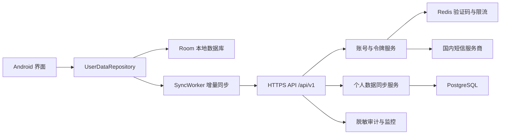

# 乡遇账号与个人数据同步接口规划

## 一、规划目标

本方案为乡遇后续增加账号、收藏云备份、个人笔记和旅行日志多设备同步做准备。第一原则是保持现有应用的本地可用性：用户不注册、不登录或网络不可用时，收藏、笔记和自建内容仍可正常使用；只有用户主动登录并开启同步后，个人数据才上传服务器。

本方案中的“日志”指用户主动撰写的旅行日志或笔记，不指设备运行日志、浏览记录或行为统计。若以后需要产品统计，应另行设计并单独征得同意，不能混入个人内容同步接口。

### 目标

- 支持中国大陆手机号验证码登录，后续可扩展微信或荣耀账号登录。
- 支持收藏、条目笔记、自建内容和独立旅行日志的云备份及多设备同步。
- 支持首次登录时将既有本机数据合并到账号，不覆盖服务器已有数据。
- 支持增量上传、增量下载、断点续传、幂等重试和冲突处理。
- 支持用户导出数据、退出登录、撤销同步和注销账号。
- 不新增短信、通讯录、存储、相册或设备标识权限。

### 暂不纳入第一期

- 公开社区、评论、点赞、关注和私信。
- 自动上传定位轨迹、搜索历史或浏览记录。
- 笔记图片和视频上传。附件涉及对象存储、内容安全审核和更高隐私风险，建议第二期单独实施。
- 将高德、必应等第三方服务 Key 下发给客户端。

## 二、现有数据与改造边界

当前个人数据分为两处：

1. `UserContentStore` 保存条目笔记、自建内容和用户对内置内容的修改，使用 `SharedPreferences` 和 JSON。
2. `MainActivity.XiangYuView` 保存收藏 ID 及条目快照，同样使用 `SharedPreferences`。

现有记录包含 `itemId`、`cityCode`、分类、标题、说明、来源、笔记、自建/修改标志、颜色、标记和可选经纬度。现有导出格式为 `xiangyu-notebook` v1，只导出有笔记的记录，并不完整覆盖收藏和无笔记的自建内容。

在接入服务器前，应先完成一次不改变界面的本地数据层改造：

- 将收藏、笔记、自建内容和日志统一迁移到 Room 数据库，保留原 SharedPreferences 自动迁移代码至少两个版本。
- 云端实体使用客户端生成的 UUID；现有 `custom-时间戳` 只作为 `legacyId`，不能继续作为跨设备主键。
- 内置条目的现有 ID 保留为 `subjectId`，例如 `310100-food-1`，用于关联城市内容。
- 每条本地记录增加 `updatedAt`、`deletedAt`、`dirty`、`serverVersion` 和 `lastMutationId`。
- 删除操作写入 tombstone（删除标记），同步成功后再按保留期清理，不能直接物理删除。
- 导入导出升级为 `xiangyu-notebook` v2，同时继续兼容读取 v1。

## 三、推荐总体架构



### Android 客户端

- `UserDataRepository`：界面只访问统一仓库，不直接操作网络或 SharedPreferences。
- Room：作为唯一事实来源，先本地写入，再由同步任务上传。
- `AuthManager`：保存登录状态，Access Token 只放内存，Refresh Token 使用 Android Keystore 加密保存。
- WorkManager：在有网络时执行增量同步，失败采用指数退避；用户手动刷新时可立即执行。
- 每个安装实例生成随机 `deviceId` UUID，只用于同步去重，不读取 IMEI、MAC、OAID 或 Android ID。

### 服务端建议

- Java 17/21 + Spring Boot 3，便于和当前 Java 工程共享数据定义及维护经验。
- PostgreSQL 保存账号与个人数据，Redis 保存验证码、短期风控状态和限流计数。
- 国内云主机和已备案域名，通过 HTTPS 对外提供服务，确保中国大陆访问稳定。
- 短信登录接入阿里云、腾讯云或华为云等合规短信服务；密钥只存服务端密钥管理系统。
- 第一阶段不需要微服务，可采用一个模块化单体服务，减少部署和运维复杂度。

## 四、账号与认证方案

### 登录方式

第一期推荐手机号验证码登录。手机号由用户手动输入，应用不读取短信；验证码由用户手动填写，也不申请 `READ_SMS` 或 `RECEIVE_SMS` 权限。

后续可以增加微信或荣耀 OAuth，但不同身份最终都绑定到同一个内部 `userId`。不要用手机号、微信 OpenID 或荣耀账号 ID 直接作为业务表主键。

### 令牌策略

- Access Token：JWT 或不可预测随机令牌，有效期建议 15 分钟。
- Refresh Token：随机高熵令牌，有效期建议 30 天，服务端只保存哈希。
- 每次刷新都轮换 Refresh Token；旧令牌再次使用时撤销该设备会话。
- 用户退出时只撤销当前设备；“退出所有设备”撤销该账号全部会话。
- 所有写接口支持 `Idempotency-Key`，防止弱网重试生成重复数据。

### 登录安全

- 同一手机号验证码发送间隔至少 60 秒，并设置手机号、IP、设备三个维度的频率限制。
- 连续异常请求触发图形验证或短信发送暂停。
- 验证码只保存哈希，5 分钟失效，验证成功后立即作废。
- 登录接口响应不暴露手机号是否已注册，避免账号枚举。
- 服务端日志不得记录验证码、完整手机号、Token、笔记正文或日志正文。

## 五、核心数据模型

### 用户 `users`

| 字段 | 类型 | 说明 |
| --- | --- | --- |
| `id` | UUID | 内部用户 ID |
| `status` | enum | `ACTIVE`、`PENDING_DELETE`、`DISABLED` |
| `display_name` | varchar(40) | 可选昵称 |
| `created_at` | timestamptz | 注册时间 |
| `updated_at` | timestamptz | 更新时间 |
| `delete_after` | timestamptz | 注销冷静期结束时间，可空 |

手机号建议拆到 `auth_identities` 表，规范化后加密保存，并额外保存不可逆 HMAC 用于唯一性查询。手机号不要明文出现在业务表、备份文件名或日志中。

### 设备会话 `sessions`

保存 `user_id`、随机 `device_id`、设备显示名称、Refresh Token 哈希、创建/刷新/过期时间、撤销时间和最近 IP 的脱敏结果。设备名称只使用系统可公开提供的型号，不采集硬件序列号。

### 同步实体 `sync_entities`

| 字段 | 类型 | 说明 |
| --- | --- | --- |
| `id` | UUID | 客户端生成的实体 ID |
| `user_id` | UUID | 数据所有者 |
| `entity_type` | enum | `FAVORITE`、`NOTE`、`CUSTOM_ITEM`、`JOURNAL` |
| `subject_id` | varchar(160) | 关联内置条目 ID，可空 |
| `city_code` | varchar(20) | 地市代码，可空 |
| `category` | smallint | 0 小吃、1 风俗、2 景区、3 避坑、4 酒店；交通不允许自建 |
| `payload` | jsonb | 经过类型校验的业务字段 |
| `version` | bigint | 服务端每次更新递增 |
| `change_seq` | bigint | 用户维度全局递增游标 |
| `client_updated_at` | timestamptz | 客户端编辑时间，仅用于展示与辅助判断 |
| `server_updated_at` | timestamptz | 服务端接收时间 |
| `deleted_at` | timestamptz | 删除标记，可空 |

数据库唯一键必须至少包含 `user_id + id`。服务端不能信任客户端传入的 `userId`，数据所有者只能从 Access Token 得到。

### 各实体 Payload

- `FAVORITE`：`subjectId`、标题/副标题/来源/颜色/标记快照。收藏状态由实体是否被删除决定。
- `NOTE`：`subjectId`、`titleSnapshot`、`content`，正文继续限制为 12000 字符。
- `CUSTOM_ITEM`：标题、说明、来源、可选经纬度、颜色和标记；保存 `legacyId` 便于旧数据迁移。
- `JOURNAL`：标题、正文、旅行日期、可选城市代码和关联条目 ID 列表。第一期只支持文字。

笔记和日志属于个人敏感内容，默认仅本人可见。服务器数据模型不要预留“公开”默认值；未来增加公开分享时必须是独立、明确的用户操作。

## 六、REST API 清单

接口根路径建议为 `https://api.example.cn/api/v1`，实际域名在备案和服务器确定后替换。完整草案见 `docs/api/openapi-sync-v1.yaml`。

### 认证接口

| 方法 | 路径 | 用途 | 是否登录 |
| --- | --- | --- | --- |
| `POST` | `/auth/sms/send` | 发送登录验证码 | 否 |
| `POST` | `/auth/sms/verify` | 验证并登录/注册 | 否 |
| `POST` | `/auth/token/refresh` | 轮换访问令牌 | 否，使用 Refresh Token |
| `POST` | `/auth/logout` | 撤销当前设备会话 | 是 |
| `POST` | `/auth/logout-all` | 撤销全部设备会话 | 是 |

### 账号接口

| 方法 | 路径 | 用途 |
| --- | --- | --- |
| `GET` | `/me` | 获取账号基本信息和同步状态 |
| `PATCH` | `/me` | 修改昵称等非敏感信息 |
| `GET` | `/me/devices` | 查看已登录设备 |
| `DELETE` | `/me/devices/{deviceId}` | 撤销指定设备 |
| `POST` | `/me/deletion-code` | 向账号绑定手机号发送注销确认码 |
| `POST` | `/me/export` | 申请导出全部个人数据 |
| `GET` | `/me/export/{jobId}` | 查询导出状态并取得短期下载地址 |
| `DELETE` | `/me` | 验证后申请注销账号 |
| `POST` | `/me/cancel-deletion` | 在冷静期内取消注销 |

### 同步接口

| 方法 | 路径 | 用途 |
| --- | --- | --- |
| `POST` | `/sync` | 一次请求同时推送本地变化并拉取服务端增量 |
| `GET` | `/sync/bootstrap` | 首次登录分批获取账号全部数据 |

推荐使用一个双向 `/sync` 接口，而不是每次编辑都调用多个 CRUD 接口。这样弱网环境下更容易保证顺序、断点和幂等；管理后台或后续 Web 端仍可另外提供标准 CRUD 接口。

## 七、同步协议

### 请求示例

```json
{
  "deviceId": "0191d5af-f564-7d48-a2bb-3fcbdb61d9d7",
  "cursor": "eyJzZXEiOjEwMjR9",
  "changes": [
    {
      "mutationId": "0191d5b0-1277-7bcc-810e-24a4124ae84e",
      "entityId": "0191d5af-09ec-7220-b4a2-febeb88fdc35",
      "entityType": "NOTE",
      "operation": "UPSERT",
      "baseVersion": 3,
      "clientUpdatedAt": "2026-08-18T09:30:00Z",
      "payload": {
        "subjectId": "310100-food-1",
        "cityCode": "310100",
        "category": 0,
        "titleSnapshot": "生煎馒头",
        "content": "上午去排队更快。"
      }
    }
  ],
  "limit": 200
}
```

### 响应示例

```json
{
  "serverTime": "2026-08-18T09:30:02Z",
  "nextCursor": "eyJzZXEiOjEwMzF9",
  "hasMore": false,
  "accepted": [
    {
      "mutationId": "0191d5b0-1277-7bcc-810e-24a4124ae84e",
      "entityId": "0191d5af-09ec-7220-b4a2-febeb88fdc35",
      "version": 4
    }
  ],
  "conflicts": [],
  "changes": []
}
```

### 协议规则

- `cursor` 是服务端生成的不透明字符串，客户端不能解析或自行递增。
- 单次最多提交和返回 200 条，正文上限建议 512 KB；`hasMore=true` 时立即继续拉取。
- `mutationId` 全局唯一。相同用户重复提交同一 `mutationId` 必须返回第一次的结果。
- `baseVersion=0` 表示新建；更新和删除必须携带客户端最后看到的服务端版本。
- 服务端接收成功后分配新 `version` 和用户级 `change_seq`。
- 客户端只有在收到 `accepted` 后才能清除对应记录的 `dirty` 状态。
- 删除也作为一条变化同步到其他设备；删除标记建议保留 30 天后再清理。
- 服务端时间是最终排序依据，不依赖可能不准确的手机时钟。

## 八、冲突处理

不能简单采用“最后上传覆盖”，因为离线设备时钟可能错误，也可能悄悄覆盖用户长笔记。

- 收藏：按集合语义处理。添加和取消均带版本；发生冲突时以服务端已接受的最新操作为准，并向客户端返回最终状态。
- 笔记与旅行日志：`baseVersion` 落后时在 `/sync` 的 `conflicts` 数组中返回 `SYNC_CONFLICT` 和服务端版本。客户端显示“保留本机、使用云端、两份都保留”；批量同步请求本身仍返回 `200`，避免一条冲突阻断其他记录。
- 自建内容：文本冲突与笔记相同；“两份都保留”时客户端为本机副本生成新 UUID。
- 不同字段自动合并只适合有明确规则的字段。第一期不要做不可解释的逐字段自动合并。
- 首次登录合并：根据云端实体 UUID、旧 `legacyId`，以及 `cityCode + category + subjectId` 逐级匹配；无法确定时保留两份。

## 九、统一错误格式

所有错误使用 JSON，并返回便于排查的 `requestId`：

```json
{
  "error": {
    "code": "SMS_RATE_LIMITED",
    "message": "验证码发送过于频繁，请稍后重试",
    "requestId": "01J5M7S3M21AZ4YK2XX1W6NR8R",
    "retryAfterSeconds": 55,
    "details": {}
  }
}
```

主要状态码：`400` 参数错误、`401` 登录失效、`403` 账号受限、`409` 单资源状态冲突、`413` 数据过大、`429` 请求过频、`500` 服务端异常。批量同步中的单条数据冲突放在成功响应的 `conflicts` 数组中。客户端提示使用中文友好文案，不直接展示内部异常或堆栈。

## 十、隐私与安全要求

接入账号和服务器后，当前隐私政策中“个人笔记仅保存在本机”和“不设用户账号”的描述必须在发布前更新。登录页应展示服务协议和隐私政策，并提供不登录继续使用入口；云同步应由用户主动开启并明确说明上传内容、用途、保存期限和注销方式。

- 服务器部署、域名备案、短信签名和隐私政策应在上线前完成。
- 全链路 TLS，不允许明文 HTTP；服务端启用 HSTS 和现代加密套件。
- 数据库磁盘和备份加密，密钥与数据库分离，生产权限最小化。
- 手机号加密存储；日志、告警、链路追踪和数据分析中统一脱敏。
- 不上传粗略位置原始坐标。个人数据只保存用户选择或条目已有的 `cityCode`；自建地点坐标需明确提示后才同步。
- 不上传高德请求、图片检索词或天气请求记录作为用户画像。
- 用户可在应用内导出数据、删除单条数据、关闭同步和注销账号。
- 注销建议设置短暂冷静期，期满删除主数据；备份中的残留按既定备份周期不可恢复地轮换清除。
- 管理后台默认不能查看笔记正文；确有故障排查需求时采用审批、短时授权和完整审计。
- 依照《个人信息保护法》《网络安全法》《数据安全法》及应用市场规则完成上线前合规复核。

## 十一、容量、限流与可观测性

第一阶段以 1 万注册用户、每人 500 条个人实体作为设计基线即可，无需提前拆分微服务。

- 同步接口：每设备建议不超过 30 次/分钟，单次最多 200 条、512 KB。
- 笔记/日志正文：单条最多 12000 字符；标题最多 160 字符。
- 账号导出：异步生成，下载链接短期有效且只能使用当前账号访问。
- 指标：登录成功率、短信发送成功率、同步延迟、冲突率、待同步条数、接口错误率和数据库慢查询。
- 告警：短信费用突增、验证码攻击、登录失败突增、同步 5xx、数据积压和备份失败。
- 应用日志只记录实体数量、耗时和错误码，不记录正文、手机号和 Token。

## 十二、分阶段实施路线

### 阶段 0：本地模型统一

1. 引入 Room，建立收藏、笔记、自建内容、旅行日志和同步队列表。
2. 将现有 SharedPreferences 无损迁移到 Room，并增加迁移测试。
3. 为所有记录补 UUID、更新时间、删除标记和版本字段。
4. 将导入导出升级为 v2，并验证仍可导入 v1 文件。

验收标准：不部署服务器时，现有收藏、笔记、编辑、导入导出全部保持可用。

### 阶段 1：账号基础设施

1. 部署国内 HTTPS API、PostgreSQL、Redis 和短信服务。
2. 完成验证码发送、登录、Token 刷新、退出和设备管理。
3. App 增加可跳过的登录页和账号页，Token 使用 Keystore 保护。

验收标准：不申请任何新增 Android 权限；验证码接口通过限流、重放和账号枚举测试。

### 阶段 2：备份与首次合并

1. 接入 `/sync/bootstrap` 和 `/sync`。
2. 首次登录明确询问是否上传本机数据。
3. 支持手动“立即同步”、同步状态、最后成功时间和错误重试。
4. 建立数据导出和账号注销流程。

验收标准：同一账号换机后能恢复数据；重复上传、断网和进程终止不会产生重复条目。

### 阶段 3：多设备双向同步

1. 增加后台增量同步和 tombstone 清理。
2. 完成长笔记冲突选择界面。
3. 覆盖两台设备同时编辑、离线一周后恢复、Token 过期和服务端分页等测试。

验收标准：任何冲突都不会静默丢失用户正文。

### 阶段 4：独立旅行日志与附件评估

1. 上线独立文字旅行日志。
2. 评估图片附件的对象存储、压缩、配额、审核、删除和费用后再决定是否开放。
3. 如增加公开分享，单独设计公开副本、审核和撤回机制，不能直接公开私人记录。

## 十三、上线前检查表

- 本地数据迁移可回滚，旧版本导出文件仍能导入。
- 登录和同步均可关闭，不登录不影响基础功能。
- 隐私政策、服务协议、注销说明和第三方清单已更新。
- APK 权限仍只有 `INTERNET` 和 `ACCESS_COARSE_LOCATION`。
- Token、短信密钥、数据库密码和签名密钥均未进入 Git 或 APK。
- 接口完成鉴权越权、重放、注入、限流、超长输入和弱网测试。
- 服务端确认用户 A 无法读取、修改或删除用户 B 的任何数据。
- 注销、导出、删除、备份恢复和审计流程完成演练。
- Android 16 真机和雷电模拟器完成首次登录、换机恢复和冲突测试。

## 十四、建议的首期最小范围

首期只实现“手机号登录 + 收藏/条目笔记/自建内容同步 + 数据导出 + 账号注销”，暂缓独立旅行日志附件、公开社区和第三方账号登录。这一范围已经能够解决换机丢失和多人设备共用问题，同时将账号、隐私和运维风险控制在可验证的边界内。
